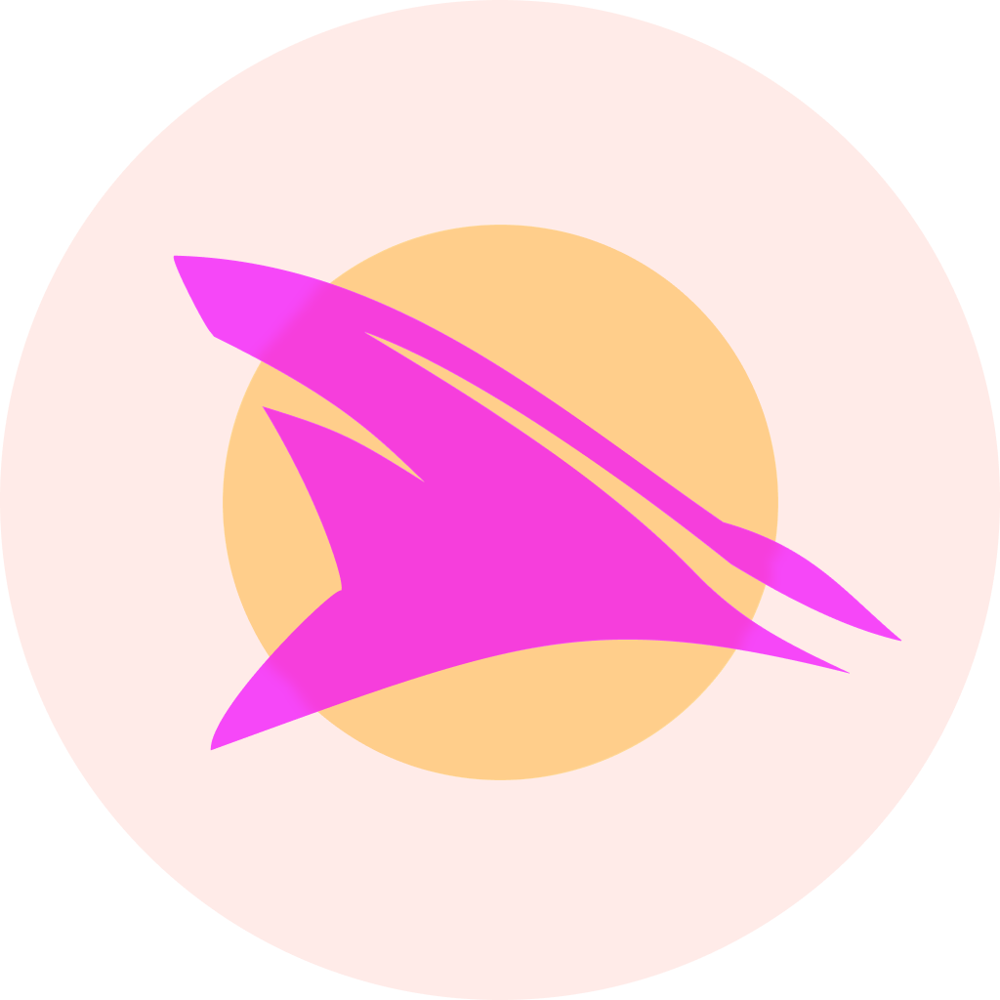

<p align="center">
  
</p>

<h1 align="center">Jelly Shark</h1>

<p align="center">
  A killer Jellyfin client for tvOS and Apple Vision Pro<br>that doesn't look like a Jellyfin client.
</p>

<p align="center">
  <a href="https://github.com/axeslasher/Jelly-Shark/actions/workflows/tests.yml"></a>
  <a href="https://github.com/axeslasher/Jelly-Shark/actions/workflows/swiftformat.yml"></a>
  <a href="LICENSE"></a>
  
  
</p>

## Another Jellyfin client?

Yeah, I know. Just what the world needs, another fucking Jellyfin client. They're a dime a dozen at this point. I know because I've tried most of them. They either disrespect the ethos of the backend they're built on by trying to make a quick buck without giving anything back, look and function like ass, or both. I got sick of it.

I've been a professional product designer for almost 20 years, working on the web, mobile, and TV interfaces. I'd been longing to get back to TV work (previously, I designed the first ever 4K TV interface for RED Digital Cinema's REDRAY, and spent time working on TV and game console apps at Starz). One of my favorite hobbies is curating my Jellyfin library, so I decided to make my own client, make it open source, and make it free.

Unlike existing Jellyfin clients that treat the interface as functional but forgettable, Jelly Shark makes the UI itself a feature: beautiful, configurable, and tailored to how you want to experience your libraries.

## Key Features

### Genre-Inspired Themes
Visual languages that evoke the mood of what you're watching. Horror fans can give their app fangs instead of a corporate suit.

- **Standard**: An elegant baseline; professional and unobtrusive.
- **Horror**: Atmospheric dread and visceral intensity; slow, tension-building motion over blood-red accents
- **Action**: Kinetic energy and technological precision; fast, explosive motion with electric cyan highlights
- **Video Store**: 90s popcorn nostalgia with Friday night vibes. Bouncy, playful motion in deep blue and gold
- **Sci-Fi**: Alien greens and engineered precision; slow, weightless motion with a phosphor glow

Each theme carries its own typeface, palette, spacing, and motion curve. Switch themes from Settings; the swap is instant, no app restart. The system is committed to dark surfaces throughout; there is no light mode.

### Professional 10-Foot UI
Designed specifically for the couch. The Home marquee, shelves, and library grids are built around the tvOS focus engine, so focus, paging, and scrolling answer to the remote instead of a scaled-up pointer layout.

### A Player That Fills In What Streaming Drops
Jellyfin's HLS output leaves the source file's chapters, metadata, and scrub previews behind. Jelly Shark reconstructs them: native trickplay seek previews, chapter markers, an in-player Cast & Crew tab, and correctly-timed subtitles on both the fMP4 and TS paths.

## Status

**In Active Development.** The core loop works end to end: connect to a Jellyfin server, browse libraries with artwork and metadata, and play items with progress tracking and resume.

**Working today:**
- **Server & session**: connect and sign in, then stay signed in; the token lives in the Keychain and is validated and restored on launch
- **Home**: a paged hero marquee, Continue Watching, Next Up (foldable into a single shelf from Settings), a Recently Added row per library, Browse by genre, and affinity shelves drawn from what you actually watch
- **Libraries**: paginated poster grids with sort, genre, decade, rating, watched-status, and favorites-only filtering
- **Detail pages** for movies, series, episodes, and collections: hero artwork, metadata and overview, a season/episode shelf, Cast & Crew, More Like This, collection contents, and Go to Series from an episode
- **People**: person pages with filmography
- **Search**: debounced live search across movies, shows, and episodes, with completion suggestions and a result grid
- **Playback**: direct play of compatible files with HLS remux/transcode fallback and true PlayMethod reporting; trickplay scrub previews; chapter markers (tvOS); audio and subtitle switching, including burned-in image subtitles; a Cast & Crew tab in the player; progress reporting, resume, and episode autoplay with an "Up Next" countdown
- **Watched & favorites**: optimistic toggles on media and person detail
- **Local caching**: a SwiftData store keeps home snapshots and per-item user state (watched, favorite, resume) so a cold launch paints from disk; artwork rides `URLCache` plus a bounded in-memory decoded-image cache
- **Design system**: five themes on a Tailwind-derived color token layer, plus a bounded decoded-artwork cache, wired throughout the app

## Roadmap

Not built yet (listed here so nothing above reads as a promise):

- **Theme deep dive**: what exists now is cool, but it can be a lot cooler. Deeper palettes, sharper type pairings, and motion that leans harder into each genre.
- **Component variants**: swappable card, hero, navigation, and list-density layouts that stay within the chosen theme's aesthetic
- **visionOS spatial experiences**: the app builds and runs on Vision Pro with the shared UI, but depth-aware and immersive layouts are not built
- **Top Shelf and Siri integration**

## Platform Support

- Apple TV 4K (tvOS 26.0+)
- Apple Vision Pro (visionOS 26.2+)

## Tech Stack

- Swift 6.2+
- SwiftUI
- AVKit / AVPlayer for direct play and HLS playback
- [jellyfin-sdk-swift](https://github.com/jellyfin/jellyfin-sdk-swift) (0.6.x) for the Jellyfin API
- Keychain for secure session storage; `URLCache` for artwork
- Swift Package Manager (modular: JellyfinKit, DesignSystem, Features)
- Swift Testing

## Building & Testing

Requires Xcode 26+. Everything runs through the `Makefile`:

```bash
make build            # build for the tvOS simulator
make build-visionos   # build for the visionOS simulator
```

Tests run in **two venues**, and a bare `xcodebuild test` covers only one of them:

- **Simulator** (`make test-sim`): the app suite plus `DesignSystemTests` and `FeaturesTests`. Those packages use tvOS/visionOS-only SwiftUI APIs and no longer compile for the Mac host, so their test targets are wired into the `Jelly Shark` scheme.
- **Host** (`make test-host`): `JellyfinKit`, via `swift test`. It's pure logic, but its Keychain and session tests need a real keychain, which a host-less simulator test bundle doesn't have.

Pick the cheapest tier that can fail on your change (timings are warm; cold, anything touching the simulator costs minutes rather than seconds):

```bash
make test-host                        # ~5s:  JellyfinKit only, no simulator
make test-only ONLY=DesignSystemTests # ~23s: one simulator suite (also: FeaturesTests, "Jelly SharkTests")
make test-sim                         #        the simulator venue on its own
make test                             # ~43s: both venues; a pre-merge check, not an iteration step
```

Formatting is SwiftFormat, pinned to **0.62.1** (`brew install swiftformat`). The Makefile refuses any other version, so local output matches CI:

```bash
make format        # format all Swift sources in place
make lint          # check only, no rewrites
make install-hooks # one-time opt-in: a lint-only pre-commit hook
```

CI runs the host suite, the tvOS simulator suite, and a visionOS build on every pull request (`.github/workflows/tests.yml`), plus `swiftformat --lint` with the same pinned version (`.github/workflows/swiftformat.yml`).

One gotcha for a fresh clone: most of the themes' typefaces are licensed from Fontshare, whose EULA forbids redistributing the files, so the `.ttf`s are git-ignored. The app still builds and runs; every text style falls back to San Francisco. `Packages/DesignSystem/Sources/DesignSystem/Resources/Fonts/FONTS.md` lists what to download and where to put it.

## Contributing

This project is in early development, but issues and pull requests are welcome. Before opening one, run `make format` and the test tier that can fail on your change; CI runs both venues and the formatter on every PR. `CLAUDE.md` covers the module layout and the conventions the codebase follows; deeper design and API notes live in `docs/`.

## License

MIT: see [LICENSE](LICENSE). Fork it, ship it, build on the packages; the only
ask is that the copyright notice comes along. Third-party terms for the bundled
font and the SPM dependencies are in
[THIRD-PARTY-NOTICES.md](THIRD-PARTY-NOTICES.md).

---

**Your media library, your style.**
